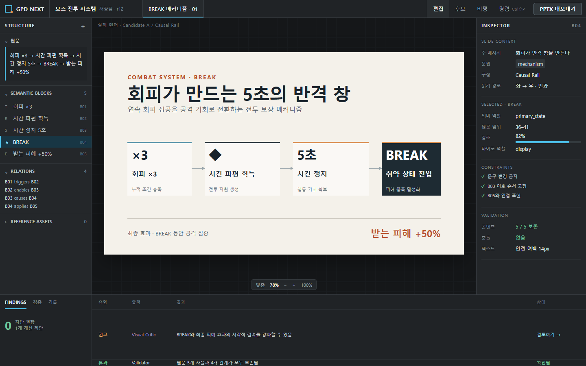
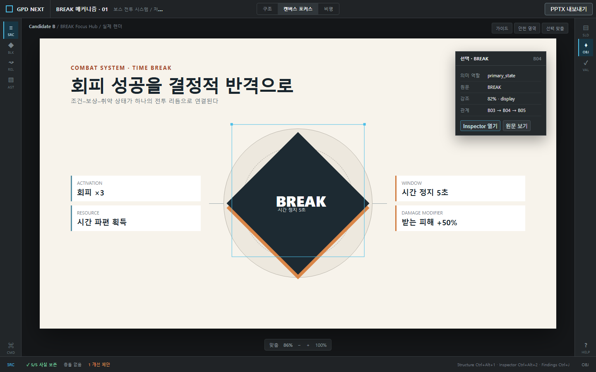
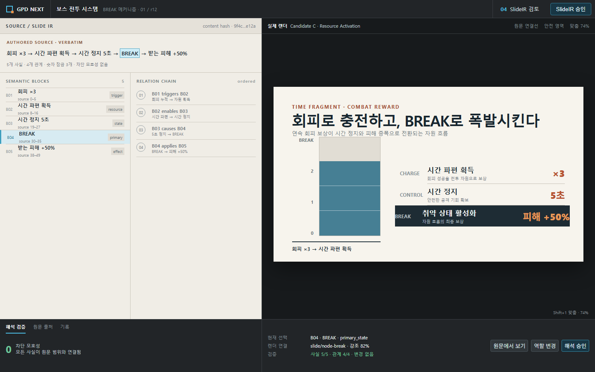
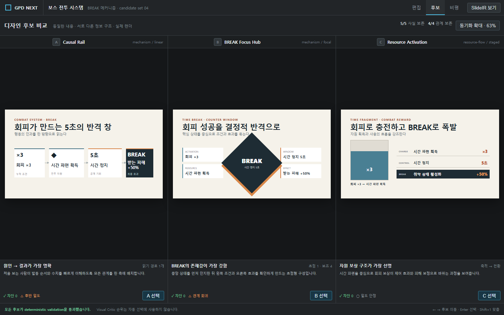
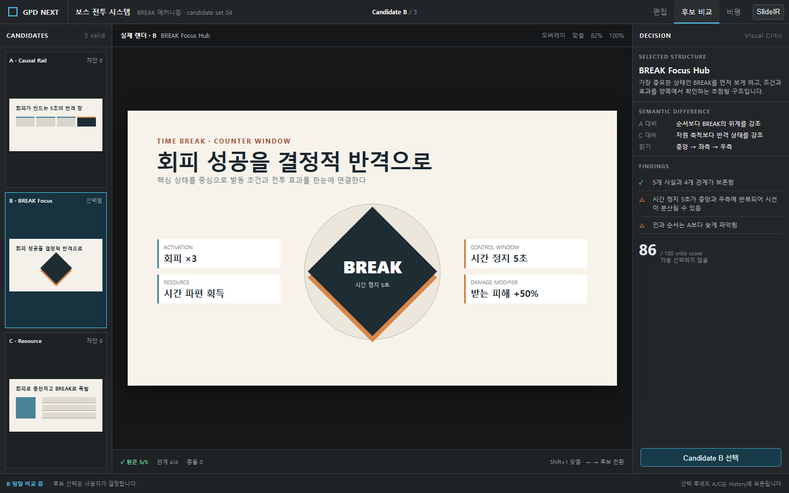
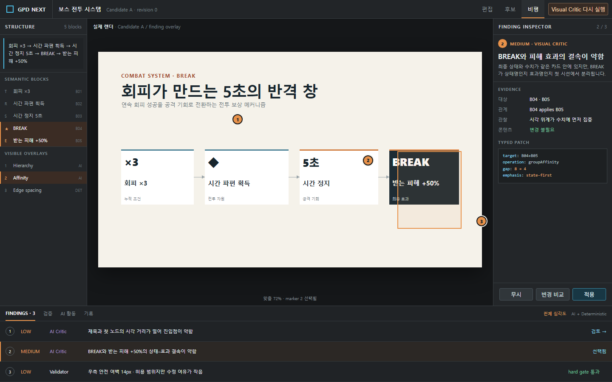
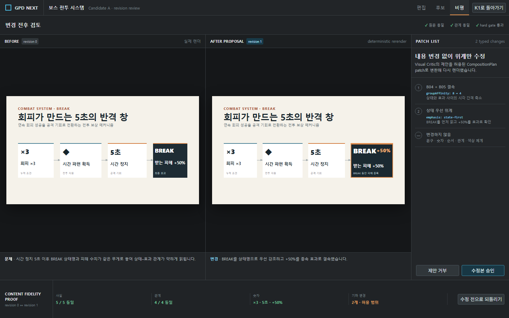

# Phase 1 Static Prototype Comparison Report

작성일: 2026-08-28  
상태: 사용자 비교·승인 대기  
범위: 정적 HTML/CSS 프로토타입, PNG 스크린샷, 화면 비교만 포함

## 이번 단계의 경계

- production React, Electron, Tauri, renderer, exporter, provider 코드는 만들지 않았다.
- 레거시 기획서 디자이너를 import하거나 수정하지 않았다.
- 각 화면은 inline CSS를 포함한 독립 HTML이며 JavaScript, 외부 폰트, 외부 이미지, 네트워크 요청이 없다.
- 공통 Graphite chrome은 색상 변수를 통제하고 구조 차이만 비교하기 위한 측정 배경이다. Direction A 승인으로 간주하지 않는다.
- 화면에 보이는 콘텐츠는 모두 MEC-01 BREAK fixture에서 왔다. Lorem Ipsum, 추상 placeholder 문구, 빈 회색 콘텐츠 상자를 사용하지 않았다.

```text
회피 ×3
→ 시간 파편 획득
→ 시간 정지 5초
→ BREAK
→ 받는 피해 +50%
```

전체 실행 링크와 스크린샷 목록은 [prototype index](../prototypes/phase1/README.md)에 있다.

## 비교 방법

각 화면을 Chrome headless, device scale 1에서 다음 viewport로 캡처했다.

- 1920×1080: 넓은 데스크톱에서 남는 공간과 정보 밀도 확인
- 1440×900: 일반 작업 환경의 기준 비교
- 1366×768: 최소 laptop stress test와 잘림 확인

공통 검토 질문:

1. 슬라이드가 앱 chrome보다 먼저 보이는가?
2. 원문, 의미 구조, 실제 렌더, finding의 연결을 이해할 수 있는가?
3. 후보 또는 변경 결과가 실제 슬라이드로 보이는가?
4. 장시간 사용 시 지속 노출된 정보가 피로를 만드는가?
5. 1366×768에서 핵심 조작과 콘텐츠가 잘리지 않는가?

## Workspace W1 — Persistent Tri-Rail

- Prototype: [W1 HTML](../prototypes/phase1/w1/index.html)
- Screenshots: [1920×1080](../prototypes/phase1/screenshots/w1/1920x1080.png) · [1440×900](../prototypes/phase1/screenshots/w1/1440x900.png) · [1366×768](../prototypes/phase1/screenshots/w1/1366x768.png)



- 핵심 의도: 원문/semantic blocks/relations, 실제 슬라이드, 선택 객체 inspector를 동시에 유지한다. 아래 drawer는 검증과 Critic 결과를 항상 같은 작업 공간에서 이어 준다.
- 참고한 reference: Figma·Penpot의 selection/inspector, Onlook의 source–canvas 동기화, VS Code의 Problems drawer와 workbench density, PowerPoint의 중앙 슬라이드 mental model, Oh My PPT의 제작–검토–history 연속성.
- 장점: 구조를 숨기지 않아 해석 신뢰도가 높다. source → block → render → inspector → finding의 경로가 가장 명확하다. 첫 사용자가 패널 위치를 추측할 필요가 적다.
- 단점: 좌우 rail과 열린 drawer가 캔버스 폭과 높이를 함께 가져간다. 동시에 보이는 개념이 많아 UI 자체가 슬라이드와 경쟁할 수 있다.
- 장시간 작업 시 예상 문제: 고정 패널을 실제로 사용하지 않는 시간에도 시야를 점유한다. 좌–중–우–하를 반복하는 시선 이동과 작은 메타 텍스트가 누적 피로를 만들 수 있다. 패널 폭 기억, 단축키, focus preset이 없으면 좁은 laptop에서 답답해질 가능성이 높다.

## Workspace W2 — Canvas-First Context Rails

- Prototype: [W2 HTML](../prototypes/phase1/w2/index.html)
- Screenshots: [1920×1080](../prototypes/phase1/screenshots/w2/1920x1080.png) · [1440×900](../prototypes/phase1/screenshots/w2/1440x900.png) · [1366×768](../prototypes/phase1/screenshots/w2/1366x768.png)



- 핵심 의도: Structure와 Inspector를 52px context rail로 접고 실제 슬라이드를 최대화한다. 선택 시 필요한 정보만 canvas 위의 임시 inspector로 연다.
- 참고한 reference: Figma의 canvas focus와 selection box, Penpot의 contextual properties, Onlook의 direct manipulation, VS Code/Zed의 activity rail과 focus mode, PowerPoint의 중앙 slide stage.
- 장점: 세 Workspace 중 슬라이드 존재감과 laptop 사용성이 가장 강하다. 현재 선택과 관련 없는 정보가 보이지 않아 시각 노이즈가 적다. 직접 조작 작업에 집중하기 쉽다.
- 단점: `SRC/BLK/REL/AST`와 `SLD/OBJ/VAL`의 의미를 학습해야 한다. 숨은 semantic 상태를 확인하려면 rail 전환이 필요하고, 떠 있는 inspector가 우측 슬라이드 영역을 가릴 수 있다.
- 장시간 작업 시 예상 문제: 자주 panel을 열고 닫는 사용자는 모드 전환 비용이 커진다. 현재 열려 있는 context가 무엇인지 놓치기 쉽고, popover 위치가 반복해서 시선을 방해할 수 있다. rail tooltip과 마지막 panel 상태 복원이 필수다.

## Workspace W3 — Semantic Split Desk

- Prototype: [W3 HTML](../prototypes/phase1/w3/index.html)
- Screenshots: [1920×1080](../prototypes/phase1/screenshots/w3/1920x1080.png) · [1440×900](../prototypes/phase1/screenshots/w3/1440x900.png) · [1366×768](../prototypes/phase1/screenshots/w3/1366x768.png)



- 핵심 의도: 작성 원문과 SlideIR 해석을 왼쪽에 문서처럼 펼치고 실제 슬라이드를 오른쪽에 놓아 content fidelity를 먼저 검토한다. Inspector는 아래 context strip으로 내려 지속 폭을 제거한다.
- 참고한 reference: Penpot의 semantic token/inspector 개념, Onlook의 source–render selection synchronization, VS Code/Zed의 split editor와 structured review, PowerPoint의 slide canvas.
- 장점: 원문 5개 사실과 4개 관계가 어떻게 시각 구조로 연결되는지 가장 직접적으로 설명한다. SlideIR 승인과 오류 수정 단계에 적합하다. 선택 객체의 원문 범위를 확인하기 쉽다.
- 단점: visual design workstation보다 schema/문서 검토 도구처럼 보일 수 있다. 짧은 fixture에서는 왼쪽 아래가 크게 비며, 속성 inspector의 지속적 접근성이 약하다.
- 장시간 작업 시 예상 문제: 의미 검토가 끝난 뒤에도 split을 유지하면 불필요한 정보가 슬라이드와 경쟁한다. 긴 원문에서는 좌측 밀도가 급격히 높아지고, 고정 42–44% 폭은 설계 작업에 과하다. 단계 전용 preset으로 제한하지 않으면 피로가 크다.

## Candidate Compare C1 — Equal Triptych

- Prototype: [C1 HTML](../prototypes/phase1/c1/index.html)
- Screenshots: [1920×1080](../prototypes/phase1/screenshots/c1/1920x1080.png) · [1440×900](../prototypes/phase1/screenshots/c1/1440x900.png) · [1366×768](../prototypes/phase1/screenshots/c1/1366x768.png)



- 핵심 의도: Causal Rail, BREAK Focus Hub, Resource Activation의 실제 렌더를 같은 크기와 같은 zoom으로 동시에 놓아 후보 간 위계 차이를 공정하게 비교한다.
- 참고한 reference: Canva의 일시적 gallery browsing, PowerPoint의 Slide Sorter, Figma의 다중 frame 관찰, Oh My PPT의 actual style preview.
- 장점: 세 후보가 동등하게 보이고 선택 편향이 가장 작다. 구성 차이와 여백, 정보 위계를 한 시선에서 비교할 수 있다. 후보별 rationale과 hard finding이 같은 위치에 있다.
- 단점: 1440 이하에서는 슬라이드 내부 작은 글자를 읽기 어렵다. 세 화면의 넓이는 같지만 세부 검토 품질은 낮고, 전체 viewport의 상당 부분이 비교용 stage에 소비된다.
- 장시간 작업 시 예상 문제: 세 후보를 가로로 반복 스캔하면서 시선 이동이 커진다. 사용자가 확대하면 동시 비교의 장점이 약해지고, 축소하면 텍스트보다 모양만 선택하게 될 수 있다. wide-screen 전용 또는 first-pass compare로 보는 편이 안전하다.

## Candidate Compare C2 — Focus + Filmstrip

- Prototype: [C2 HTML](../prototypes/phase1/c2/index.html)
- Screenshots: [1920×1080](../prototypes/phase1/screenshots/c2/1920x1080.png) · [1440×900](../prototypes/phase1/screenshots/c2/1440x900.png) · [1366×768](../prototypes/phase1/screenshots/c2/1366x768.png)



- 핵심 의도: 선택 후보 하나를 크게 읽고, 왼쪽 filmstrip에서 나머지 두 후보로 전환하며, 오른쪽 decision panel에서 semantic difference와 finding을 확인한다.
- 참고한 reference: PowerPoint의 thumbnail rail + slide canvas, Figma의 selected frame focus, Onlook의 선택–속성 연결, Canva의 thumbnail browsing, Oh My PPT의 page-level preview workflow.
- 장점: 1366×768에서도 선택 슬라이드 본문을 읽을 수 있다. 후보 선택의 이유와 다른 안과의 차이를 동시에 확인할 수 있어 정밀 판단에 유리하다. filmstrip이 대안을 잃지 않게 한다.
- 단점: 세 후보를 완전히 같은 조건으로 동시에 볼 수 없다. 큰 선택 화면이 초기 후보를 더 좋아 보이게 만드는 selection bias를 만든다. 비교하려면 기억과 전환이 필요하다.
- 장시간 작업 시 예상 문제: 반복 전환과 이전 후보의 세부 기억 부담이 생긴다. 오른쪽 Critic 요약이 사용자의 미적 판단을 과도하게 선도할 수 있다. 초기 후보를 무작위화하거나 C1 first-pass에서 진입하는 보완이 필요할 수 있다.

## Critic K1 — Anchored Findings + Bottom Drawer

- Prototype: [K1 HTML](../prototypes/phase1/k1/index.html)
- Screenshots: [1920×1080](../prototypes/phase1/screenshots/k1/1920x1080.png) · [1440×900](../prototypes/phase1/screenshots/k1/1440x900.png) · [1366×768](../prototypes/phase1/screenshots/k1/1366x768.png)



- 핵심 의도: 실제 슬라이드에 finding 번호와 대상 범위를 고정하고, 선택 finding의 evidence와 typed patch를 오른쪽에서 설명하며, 전체 finding은 아래 drawer에서 관리한다.
- 참고한 reference: VS Code의 Problems drawer, Figma/Penpot의 object selection과 contextual inspector, Onlook의 source–visual checkpoint, PowerPoint의 Selection Pane mental model.
- 장점: 문제 위치, 의미 대상, 근거, 제안 patch의 연결성이 가장 강하다. deterministic finding과 AI finding을 같은 목록에서 출처와 함께 비교할 수 있다. 수정 전 K1 → 변경 비교 K2의 흐름이 명확하다.
- 단점: marker, highlight, Structure, Inspector, drawer가 동시에 열리면 화면이 복잡해진다. finding이 많을수록 실제 디자인 감상보다 오류 사냥 화면이 된다.
- 장시간 작업 시 예상 문제: 상시 Critic mode는 결함 피로와 과잉 수정 성향을 만든다. drawer 높이가 캔버스를 줄이고, marker가 실제 여백 판단을 방해한다. 기본은 닫힌 상태여야 하며 finding 집중 모드로 제한하는 편이 적절하다.

## Critic K2 — Before / After Review

- Prototype: [K2 HTML](../prototypes/phase1/k2/index.html)
- Screenshots: [1920×1080](../prototypes/phase1/screenshots/k2/1920x1080.png) · [1440×900](../prototypes/phase1/screenshots/k2/1440x900.png) · [1366×768](../prototypes/phase1/screenshots/k2/1366x768.png)



- 핵심 의도: 실제 수정 전 렌더와 deterministic 재렌더를 나란히 놓고, 오른쪽 typed patch와 아래 content-fidelity proof를 통해 변경의 안전성을 확인한다.
- 참고한 reference: VS Code/Zed의 diff review, Onlook의 checkpoints와 reversible changes, PowerPoint의 slide-to-slide 비교 mental model, Figma의 variant/frame 비교.
- 장점: “무엇이 바뀌었고 무엇이 유지됐는지”를 가장 설득력 있게 보여 준다. 원문, 관계, 숫자 동일성을 별도 proof bar로 고정하며 수정 거부/승인/되돌리기가 명확하다.
- 단점: 두 슬라이드와 patch panel이 동시에 필요해 laptop에서 각 슬라이드가 작다. finding을 발견하는 화면이 아니라 유효한 rerender가 나온 뒤에만 쓸 수 있는 검토 상태다.
- 장시간 작업 시 예상 문제: 작은 차이를 찾기 위해 좌우를 반복하면 눈이 피로하다. zoom/viewport가 동기화되지 않으면 비교 신뢰도가 떨어지고, patch가 여러 개 누적되면 목록이 과밀해진다. 한 번의 bounded revision과 selected finding 검토에만 제한해야 한다.

## 해상도별 관찰

| Screen | 1920×1080 | 1440×900 | 1366×768 |
|---|---|---|---|
| W1 | 캔버스와 3개 panel 균형이 안정적 | 기준 상태로 읽기 양호 | 잘림은 없지만 canvas와 Inspector가 밀집 |
| W2 | slide protagonist가 가장 분명 | popover와 선택 영역이 공존 가능 | 가장 넓은 실제 슬라이드 유지, top metadata 일부 축약 |
| W3 | 의미 pane의 빈 면적이 크게 보임 | SlideIR 연결을 읽기 좋음 | 잘림 없음, left split의 비중은 여전히 큼 |
| C1 | 세 실제 슬라이드 비교가 가장 유효 | 구성 비교 가능, 본문 세부는 작음 | 형태 비교 중심이며 세부 문구 정밀 검토에는 부족 |
| C2 | selected slide와 decision evidence가 여유로움 | 정밀 판단에 충분 | filmstrip/decision을 유지하면서 본문 읽기 가능 |
| K1 | finding 근거와 slide 위치를 함께 읽기 좋음 | 기준 진단 상태로 안정적 | 잘림 없음, drawer와 Inspector 밀도가 높음 |
| K2 | before/after 차이가 가장 명확 | 위계 변경을 확인 가능 | 잘림 없음, 슬라이드 내부 세부 비교는 확대 필요 |

## 구조 비교 요약

| 질문 | W1 / C1 / K1 계열 | W2 / C2 / K2 계열 | W3 특성 |
|---|---|---|---|
| 무엇을 우선하는가 | 동시 가시성과 진단 정보 | 현재 대상의 집중과 결정 | 의미 해석과 원문 보존 |
| 숨겨지는 정보 | 가장 적음 | context rail/filmstrip 뒤에 일부 숨김 | object inspector가 아래 context로 이동 |
| laptop 적합성 | 보통 | 높음, K2는 보통 | 보통 |
| 학습 부담 | 패널 수가 많지만 발견 가능 | rail과 상태 전환 학습 필요 | SlideIR 개념 이해 필요 |
| 장기 피로 원인 | 지속 정보량과 시선 이동 | mode 전환과 기억 부담 | semantic 밀도와 화면 분할 |

## QA 결과

- 독립 HTML: 7개
- screenshot: 21개
- PNG pixel dimension: 요청한 3개 viewport와 전부 일치
- fixture 다섯 항목 포함: 7 / 7
- Lorem Ipsum: 0
- JavaScript: 0
- 외부 네트워크/asset 의존: 0
- 1366×768 육안 검사: viewport 잘림 0
- production source 또는 package dependency 추가: 0

## 사용자 승인에서 결정할 항목

이 보고서는 아직 우승안을 지정하지 않는다. 다음 결정을 사용자 비교 후 기록해야 한다.

1. Workspace: W1 / W2 / W3 중 하나 또는 구체적으로 명시한 hybrid
2. Candidate Compare: C1 / C2, 혹은 wide-screen C1 + laptop C2 같은 조건부 전환
3. Critic: K1 / K2 중 하나가 아니라 K1 진단 → K2 변경 검토의 연속 workflow로 승인할지 여부
4. Graphite 측정 skin을 유지할지, Warm Editorial 또는 Technical Atelier로 별도 visual-direction prototype을 요구할지 여부

이 네 항목이 승인되기 전 production UI 구현을 시작하지 않는다.
