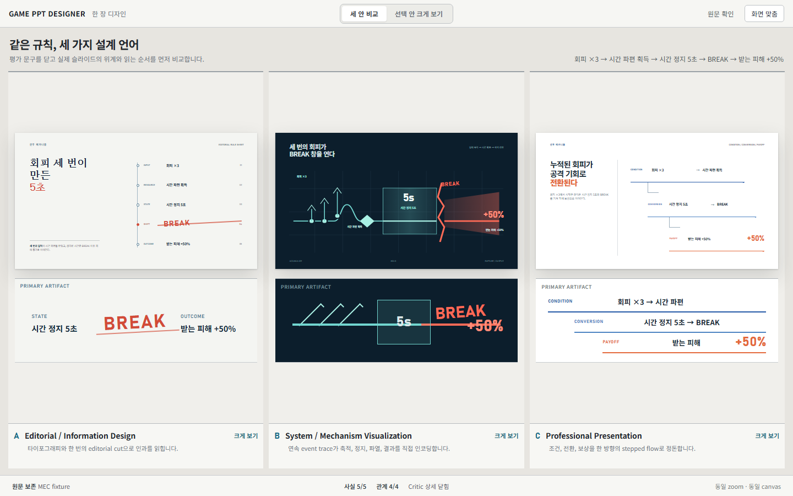
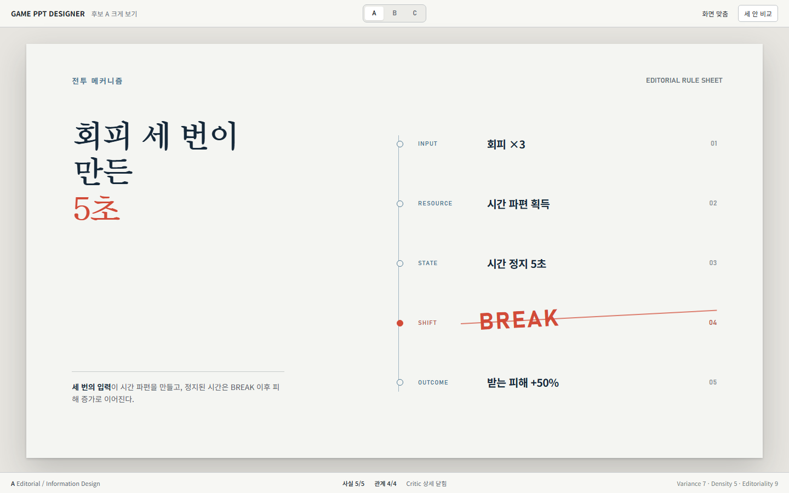
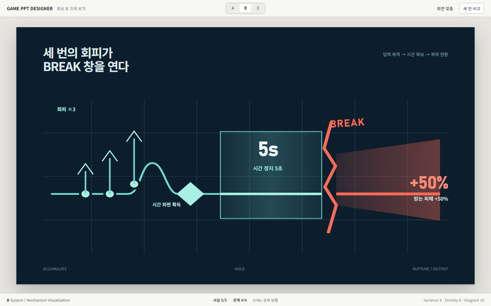
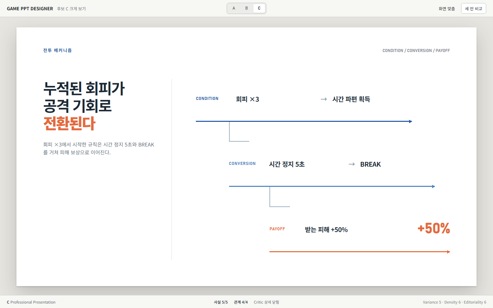

# Phase 1 Round 2 Visual Re-exploration Report

작성일: 2026-08-28  
상태: 사용자 비교 및 승인 대기  
범위: Skill/Reference 적용 기록, 정적 HTML/CSS prototype, PNG screenshot, screenshot 기반 Visual Critique

## 결과 요약

Round 1의 dark Graphite skin과 box-line slide 문법을 이어서 polish하지 않았다. 공통 프로그램 UI는 light warm-neutral `Production Table`로 다시 만들었고, slide는 다음 세 art direction으로 재구성했다.

- A: Editorial / Information Design
- B: System / Mechanism Visualization
- C: Professional Presentation

세 안 모두 다음 fixture의 다섯 사실과 네 관계를 유지한다.

```text
회피 ×3
→ 시간 파편 획득
→ 시간 정지 5초
→ BREAK
→ 받는 피해 +50%
```

production React, Electron, Tauri, renderer, exporter, provider 코드는 만들지 않았다. legacy와 Round 1 prototype은 수정하지 않았다.

## 실제 Skill과 Reference 적용

확인한 upstream snapshot:

- Anthropic frontend-design: `anthropic/skills@3b3fad9`
- Taste Skill: `leonxlnx/taste-skill@ccbc156`
- UI UX Pro Max: `nextlevelbuilder/ui-ux-pro-max-skill@8bd29e7`
- Oh My PPT layout skill: `arcsin1/oh-my-ppt@73b9720`

실제 적용:

- frontend-design: subject grounding, deliberate point of view, code 전 palette/type/layout/signature 명세, screenshot 재비평
- Taste Skill: `DESIGN_VARIANCE`, `VISUAL_DENSITY`, anti-default, 카드/shape/copy 일관성 검사
- UI UX Pro Max: heavy chrome 회피, neutral canvas, type scale, contrast, responsive checks만 검색해서 적용
- Oh My PPT: Message, Role, Reading Path, Content Shape, Density, budget, self-check의 판단 순서만 적용
- Reference Audit: Oh My PPT/PowerPoint의 presentation workflow, Figma/Onlook/Penpot의 canvas와 selection, VS Code/Zed의 compact workbench만 역할별로 적용

적용 세부와 폐기한 generic recommendation은 [Round 2 Skill application](ROUND2_SKILL_APPLICATION.md)에, 코드 전 direction 명세는 [Round 2 Visual directions](ROUND2_VISUAL_DIRECTIONS.md)에 기록했다.

## Screenshot 이후 실제 revision

첫 렌더에서 A와 C는 Quality Floor를 통과시키지 않았다.

- A 1차 문제: 큰 `3`, `5`, `+50%`와 수직 BREAK 색면이 Round 1의 큰 수치/큰 도형 문법을 반복했다.
- A 수정: 큰 수치 equation을 폐기하고 serif headline과 vertical editorial sequence로 다시 구성했다. BREAK는 box가 아니라 sequence를 벗어나는 typographic cut으로 바꿨다.
- C 1차 문제: 세 개의 큰 색면 band가 PowerPoint 기본 SmartArt처럼 보였다.
- C 수정: 모든 band fill을 제거하고 condition/conversion/payoff가 서로 다른 시작점에서 전진하는 stepped flow line으로 다시 구성했다.
- Compare 1차 문제: 세 full-slide thumbnail만 놓았을 때 남는 세로 면적이 컸다.
- Compare 수정: 설명 panel을 채우지 않고 각 slide의 primary artifact 확대를 추가했다. 전체 구도와 세부 판독을 같은 화면에서 분리했다.

B는 첫 렌더에서 event trace, hold field, rupture seam의 의미가 분명했고 box-node diagram으로 보이지 않아 구조를 유지했다.

## Prototype 및 screenshot

전체 index: [Phase 1 Round 2 prototypes](../prototypes/phase1-round2/README.md)

### Candidate Proof Table

- HTML: [compare prototype](../prototypes/phase1-round2/compare/index.html)
- Screenshot: [1920×1080](../prototypes/phase1-round2/screenshots/compare/1920x1080.png) · [1440×900](../prototypes/phase1-round2/screenshots/compare/1440x900.png) · [1366×768](../prototypes/phase1-round2/screenshots/compare/1366x768.png)



- 핵심 의도: 세 후보를 같은 zoom과 같은 canvas 크기로 먼저 비교하고, 바로 아래 primary artifact 확대에서 reading path의 핵심을 판독한다. Critic 설명은 닫힌 proof strip으로 축소한다.
- 참고한 reference: PowerPoint의 slide mental model, Figma의 multi-frame observation, Oh My PPT의 actual style preview, Canva의 gallery browsing, VS Code/Zed의 compact chrome, Penpot의 progressive disclosure.
- 장점: dark chrome과 black empty stage가 사라졌다. 세 slide와 세 artifact crop이 화면 대부분을 차지하고, 후보 전환이나 panel 조작 없이 topology와 art direction을 동시에 비교할 수 있다.
- 단점: 1440 이하에서 full slide의 세부 본문은 thumbnail 크기다. artifact 확대가 이를 보완하지만 한 장의 전체 디테일을 검토하려면 focus view가 필요하다. B의 dark slide가 높은 면적 contrast 때문에 첫 시선을 더 빨리 받을 수 있다.
- 장시간 작업 시 예상 문제: artifact crop을 항상 유지하면 같은 내용을 두 번 보는 피로가 생길 수 있다. production에서는 first-pass compare에서만 열고, 선택 뒤에는 filmstrip 또는 focus view로 접는 것이 적절하다.

### A: Editorial / Information Design

- HTML: [A prototype](../prototypes/phase1-round2/a-editorial/index.html)
- Screenshot: [1920×1080](../prototypes/phase1-round2/screenshots/a-editorial/1920x1080.png) · [1440×900](../prototypes/phase1-round2/screenshots/a-editorial/1440x900.png) · [1366×768](../prototypes/phase1-round2/screenshots/a-editorial/1366x768.png)



- 핵심 의도: `회피 세 번이 만든 5초`를 editorial headline으로 먼저 제시하고, 오른쪽의 다섯 단계가 논리를 완성한다. BREAK만 축을 이탈해 상태 전환을 표현한다.
- 참고한 reference: Anthropic frontend-design의 subject-grounded structural device, Taste Skill의 editorial/serif discipline과 anti-card rule, Oh My PPT의 message-first decision path, Affinity Publisher/InDesign의 type-led information hierarchy.
- 장점: 카드와 큰 도형 없이 typography, 여백, alignment로 위계를 만든다. 다섯 사실이 개별 line으로 남아 content audit이 쉽고, BREAK가 의미 있는 유일한 시각적 일탈이다.
- 단점: serif headline과 큰 여백은 시스템 규칙의 정밀함보다 기획 문서의 editorial mood를 먼저 느끼게 할 수 있다. 긴 source text로 확장될 때 오른쪽 sequence의 row height가 빠르게 부족해진다.
- 장시간 작업 시 예상 문제: 한 deck에서 반복하면 publication tone이 과해질 수 있다. portfolio/section-opening 성격의 mechanism slide에 선택적으로 쓰고, 일반 작업 slide에는 더 중립적인 type preset이 필요하다.

### B: System / Mechanism Visualization

- HTML: [B prototype](../prototypes/phase1-round2/b-mechanism/index.html)
- Screenshot: [1920×1080](../prototypes/phase1-round2/screenshots/b-mechanism/1920x1080.png) · [1440×900](../prototypes/phase1-round2/screenshots/b-mechanism/1440x900.png) · [1366×768](../prototypes/phase1-round2/screenshots/b-mechanism/1366x768.png)



- 핵심 의도: 세 번의 회피 pulse, 시간 파편, 5초 hold, BREAK rupture, +50% output을 하나의 continuous event trace로 읽힌다.
- 참고한 reference: core game-design-grammar의 mechanism relation, Oh My PPT의 dominant artifact/reading path/self-check, 게임 combat telemetry와 timing notation, PowerPoint의 한 장짜리 process explanation mental model.
- 장점: node box를 연결하지 않고도 인과와 시간을 가장 직접적으로 보여 준다. 3회의 입력, 5초 구간, BREAK 이후 증폭이 각각 다른 graphic behavior를 가져 semantic mapping이 강하다.
- 단점: 세 안 중 가장 실험적이고 dark slide라 compare overview에서 시각적 우선권을 얻는다. 인쇄나 밝은 회의실 projection에서는 thin grid와 muted auxiliary label의 대비가 약해질 수 있다.
- 장시간 작업 시 예상 문제: 모든 mechanism을 telemetry style로 만들면 deck가 HUD처럼 보일 수 있다. 실제 시간/축적/전환 관계가 있는 slide에만 제한하고, dark slide의 연속 사용을 deck rhythm에서 제한해야 한다.

### C: Professional Presentation

- HTML: [C prototype](../prototypes/phase1-round2/c-professional/index.html)
- Screenshot: [1920×1080](../prototypes/phase1-round2/screenshots/c-professional/1920x1080.png) · [1440×900](../prototypes/phase1-round2/screenshots/c-professional/1440x900.png) · [1366×768](../prototypes/phase1-round2/screenshots/c-professional/1366x768.png)



- 핵심 의도: 실제 게임회사 내부 리뷰와 포트폴리오에 바로 쓸 수 있는 안정된 위계 안에서 condition, conversion, payoff를 stepped flow로 정돈한다.
- 참고한 reference: PowerPoint/Keynote의 presentation clarity, Figma/Penpot의 precise alignment, Oh My PPT의 pattern/style 분리, UI UX Pro Max에서 채택한 modular type scale과 contrast 규칙.
- 장점: 세 안 중 가장 익숙하고 범용적이지만 default SmartArt의 equal box를 쓰지 않는다. phase의 시작점, line length, accent가 진행과 payoff를 구분하고 정확한 수치가 선명하다.
- 단점: A와 B보다 signature가 절제되어 첫인상은 덜 강하다. phase가 더 많아지면 stepped offset이 오른쪽 폭을 소모하고, 긴 한국어 label은 horizontal line 위에서 충돌할 수 있다.
- 장시간 작업 시 예상 문제: 안전한 방향이라는 이유로 이 style이 deck 전체의 기본값이 되면 구조 다양성이 줄어든다. phase 수와 label 길이에 따라 aligned-row나 compact table로 넘어가는 fallback이 필요하다.

## Screenshot 기반 해상도 Critique

| Viewport | 관찰 | 판정 |
|---|---|---|
| 1920×1080 | focus slide는 1500×844까지 커지고 app chrome은 88px만 사용한다. compare의 artifact crop은 넓은 화면에서도 의미 있는 크기를 유지한다. 과도한 확대나 빈 black stage가 없다. | Pass |
| 1440×900 | focus slide의 본문과 auxiliary label이 모두 판독 가능하다. compare에서 full slide는 구성 비교, artifact crop은 상세 비교 역할이 분명하다. | Pass |
| 1366×768 | focus view의 slide가 viewport 높이에 맞춰지고 header/footer와 충돌하지 않는다. compare의 full slide 본문은 작지만 핵심 hierarchy와 crop label은 읽힌다. 가로 스크롤과 잘림이 없다. | Pass with known thumbnail tradeoff |

## Quality Floor 판정

### Semantic hard gate

| Candidate | 사실 5/5 | 관계 4/4 | 새 gameplay fact 없음 | 판정 |
|---|---:|---:|---:|---|
| A | Pass | Pass | Pass | Pass |
| B | Pass | Pass | Pass | Pass |
| C | Pass | Pass | Pass | Pass |

### Slide design gate

| Gate | A | B | C |
|---|---|---|---|
| 3초 message | headline | title + trace | claim + phase flow |
| Dominant artifact | vertical sequence | temporal trace | stepped flow |
| Card-grid 비의존 | Pass | Pass | Pass |
| Semantic graphic | axis/cut | pulse/hold/rupture/output | phase line/handoff |
| Intentional whitespace | Pass | Pass | Pass |
| Collision/overflow | 3 viewports Pass | 3 viewports Pass | 3 viewports Pass |
| 독립 사용 품질 | Pass | Pass | Pass |

### Diversity gate

| Axis | A | B | C |
|---|---|---|---|
| Typography | Korean serif headline + sans sequence | condensed technical + Korean sans | Korean sans + numeric utility |
| Composition | two-column editorial sequence | full-width continuous trace | claim + offset three-phase flow |
| Hierarchy | message, sequence, cut | trace, rupture, output | claim, phase, payoff |
| Graphic language | editorial axis | telemetry/timing | professional directional rules |
| Grouping | five authored beats | accumulate/hold/rupture/output | condition/conversion/payoff |

다섯 축 모두 실질적으로 다르다. 세 후보는 palette swap이 아니다.

## QA

- 독립 HTML/CSS: 4개
- screenshot: 12개
- PNG pixel dimensions: 요청한 세 viewport와 전부 일치
- fixture 다섯 항목 포함: 4/4 HTML
- Lorem Ipsum: 0
- JavaScript: 0
- 외부 network/font/image dependency: 0
- 1366×768 가로 스크롤, viewport clipping: 0
- production source/dependency 추가: 0
- legacy 수정: 0

## 승인 대기

이번 보고서는 우승안을 지정하지 않는다. `Production Table` UI와 A/B/C visual direction은 모두 미승인 상태다. 다음 production 단계로 넘어가기 전에 사용자가 다음을 결정해야 한다.

1. 프로그램 UI의 light Production Table 방향을 유지할지
2. 비교 화면의 `full slide + primary artifact crop` 구조를 유지할지
3. A/B/C 중 선택, 조합, 추가 재탐색 중 무엇을 진행할지

승인 전에는 React/Electron/Tauri, renderer, PPTX exporter 구현을 시작하지 않는다.
